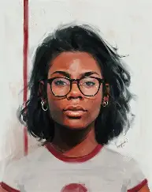

# Activity - Create a Digital Self Portrait: Use AI (Bing Image Creator) to generate a self-portrait that reflects your personality and style.

## Summary

In this activity, you'll learn how to craft increasingly detailed prompts for AI image generation, specifically to create a personalized digital self-portrait. You'll start with basic prompts and progressively add more specificity, learning how each layer of detail enhances the AI's ability to generate an image that truly reflects your personality and style. By the end, you'll understand the power of prompt engineering and how to guide AI tools like Bing Image Creator to produce customized, high-quality visual content.




## Activity Steps

1. **Start Simple**: Begin with a basic prompt like:

    ```text
    A portrait of a student
    ```

2. **Add Personal Attributes**: Enhance your prompt with specific details about your appearance:

   Add the following to your current prompt

   ```text
   wearing [specific clothes], with a [facial expression] expression
   ```

3. **Add Environment and Mood**: Incorporate setting and emotional elements:
   
   Add the following to your current prompt

   ```text
   with [specific lighting], in [art style] style
   ```

4. **Add Symbolic Elements**: Include objects that represent your interests:

   Add the following to your current prompt

   ```text
   surrounded by symbols of their interests including [hobby item 1],
   [hobby item 2], and [meaningful object]
   ```

5. **Example of a Complete Portrait**: Use a comprehensive prompt with technical direction:

   ```text
   Create a high-resolution, professional digital self-portrait of a [age] 
   year old [gender] student with [specific hairstyle/color], [eye color] eyes, 
   and [distinctive facial feature]. They're wearing [detailed outfit description] 
   that represents their personality. Include subtle background elements 
   showing their interests in [interest 1], [interest 2], and [interest 3]. 
   The portrait should be in [specific artistic style] with 
   [lighting technique] that highlights their face. The composition should be 
   [composition style] with a [color palette] color scheme that evokes 
   [emotion]. The portrait should look polished and realistic while maintaining
   artistic quality, with fine details in the face and clothing textures.
   ```
